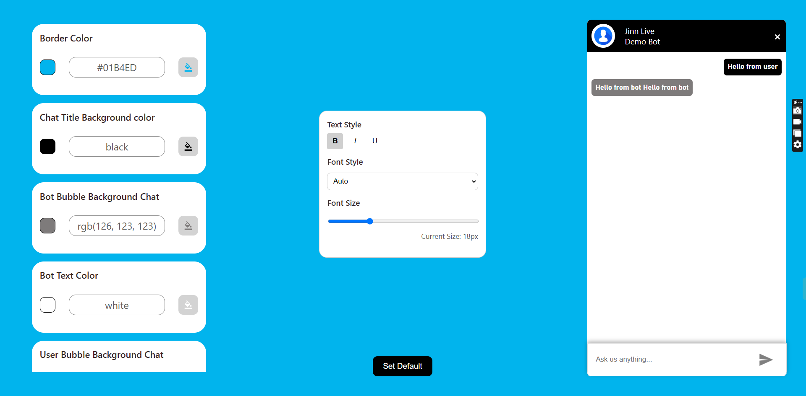

# ✨ Customizable Chat Bot

  

A **highly customizable chatbot** built with **React** and **Redux**, offering real-time customization features such as:

- 🎨 **Customizable Colors**: Change the chatbot’s appearance.
- 🔤 **Adjustable Fonts**: Modify font sizes and families to suit your style.
- ⚡ **Real-Time Updates**: See changes instantly while you tweak settings.
- 🛠️ **Easy Integration**: Add to your project with minimal effort.

---

## 🛠️ Features

- **Color Customization:** Easily set your preferred background and text colors.
- **Font Control:** Adjust font size and font family to fit your design needs.
- **Real-Time Previews:** See your changes as you make them.
- **Scalable Architecture:** Built with React and Redux for optimal performance and state management.

---

## 🚀 Quick Start

Follow these steps to get started with your customizable chatbot:

### 1️⃣ Clone the Repository
```bash
$ git clone https://github.com/Vicky8180/Jinn_assignment.git
$ cd custom-chatbot
```

### 2️⃣ Install Dependencies
```bash
$ npm install
```

### 3️⃣ Start the Development Server
```bash
$ npm start
```
The app will be available at `http://localhost:3000`.

### 4️⃣ Build for Production
```bash
$ npm run build
```
Your optimized app will be in the `build/` directory.

---

## 📁 Project Structure

```plaintext
custom-chatbot/
├── src/
│   ├── components/      # React components
│   ├── redux/           # Redux actions and reducers
│   ├── styles/          # CSS and styling files
│   ├── App.js           # Main application file
│   └── index.js         # Entry point
├── public/              # Static files
├── package.json         # Node dependencies
└── README.md            # Project documentation
```

---

## 🖼️ Screenshots

| Customization Panel | Chatbot UI |
|---------------------|------------|
|  |  |

---

## 📚 Technologies Used

- **React:** A JavaScript library for building user interfaces.
- **Redux:** State management for predictable and scalable apps.
- **CSS Modules:** Scoped and reusable styling.

---

## 🤝 Contributing

Contributions, issues, and feature requests are welcome! Feel free to:

1. Fork this repository.
2. Create a new branch: `git checkout -b feature-branch-name`.
3. Make your changes and commit them: `git commit -m 'Add some feature'`.
4. Push to the branch: `git push origin feature-branch-name`.
5. Submit a pull request.

---

## 📄 License

This project is licensed under the **MIT License**. See the [LICENSE](LICENSE) file for details.

---

## 💬 Contact

For support or inquiries, please reach out:

- Email: [your-email@example.com](vyadav99x1@gmail.com)
- GitHub: [https://github.com/your-username](https://github.com/Vicky8180)

---

### Made with ❤️ by [Your Name].
